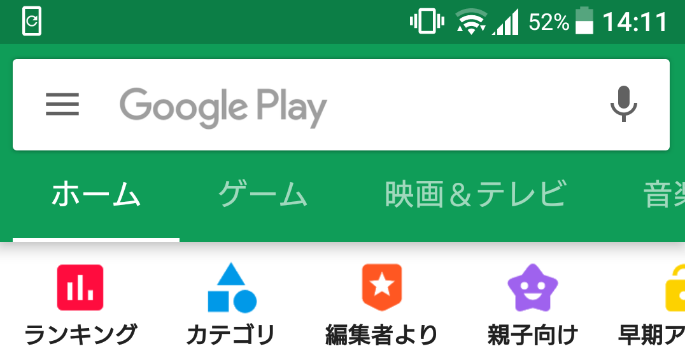
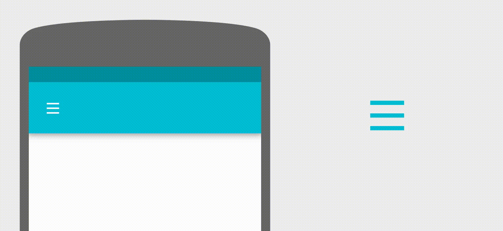

Google Play ストアのトップページのUIを考察してみた
# はじめに

Qiita初投稿です。ここ１年はAndroidをメインでやってます。
マテリアルデザインを勉強していて、PlayストアのUIがいい感じだったので、構成を考察してみました。
（個人的な考察なので、実際のところはわかりません。）

- Playストアのバージョン 9.4.18



# 前提条件

- Android Studio 3.1.0
- targetSdkVersion 27
- minSdkVersion 21
- compileSdkVersion 27

# レイアウト構成

## `DrawerLayout` + `NavigationView`

- 基本的なナビゲーションドロワーの構成

## `CoordinatorLayout` + `AppBarLayout`

- この構成により、コンテンツ部分のスクロールと連動して`Toolbar`が隠れるようになっています

## `TabLayout` + `ViewPager`

- メインのコンテンツ部分は基本的なタブの構成
- ポイントはタブ選択時のアニメーション
  - `Reveal`と呼ばれるもので、詳細は後述します
  - カテゴリごとにヘッダー部分の色が変化します

## `SearchView` + `AnimatedVectorDrawable`

- 検索バーの部分
- ポイントは検索バーにフォーカスが当たるとメニューアイコンがアニメーションするところ
- `AnimatedVectorDrawable`を使えば簡単にできそう



# 実装方法について

## ヘッダー部分の`Reveal`

### 概要

- タブ選択時に`AppBarLayout`の背景色が`Reveal`というアニメーションで切り替わるようになっています
- `Reveal`はユーザーがタップした時に波紋状に広がるアニメーションのことです
  - [Radial reaction][1]に記載されています

### 考察

- ステータスバーの部分も綺麗にアニメーションしていたので、ステータスバーを透過させてるのかと思ったのですが、コンテンツをスクロールすると`Toolbar`がステータスバーの下に隠れてるので、透過ではなさそう。。。
- `AppBarLayout`とステータスバーの部分で２つアニメーション用の`View`があればできそう

### 実装方法

- `AppBarLayout`とステータスバーは透過させて、それぞれのアニメーション用の`View`と背景用の`View`を用意すればできます
- アニメーションの起点はタブに`CustomView`を設定して、そこから計算できそう
- イケてないかもしれませんが、こんなレイアウト構成なら実装できました

```xml
<DrawerLayout>
  <CoordinatorLayout>
    <FrameLayout>
      <View/> <!-- AppBarLayoutのアニメーション時の背景用 -->
      <View/> <!-- AppBarLayoutのアニメーション用 -->
    </FrameLayout>
    <AppBarLayout>
      <Toolbar/>
      <TabLayout/>
    </AppBarLayout>
    <FrameLayout>
      <View/> <!-- ステータスバーのアニメーション時の背景用 -->
      <View/> <!-- ステータスバーのアニメーション用 -->
    </FrameLayout>
    <ViewPager/>
  </CoordinatorLayout>
  <NavigationView/>
</DrawerLayout>
```

- アニメーションの実装は`ViewAnimationUtils.createCircularReveal()`を使えば簡単にできます。
- 複数アニメーションは`AnimatorSet`でまとめると良いです

```java
private View reveal;          // Reveal用のView(AppBarLayout)
private View statusReveal;    // Reveal用のView(ステータスバー)
private View bgReveal;        // アニメーション中の背景用(AppBarLayout)
private View bgStatusReveal;  // アニメーション中の背景用(ステータスバー)

/**
 * Revealの開始
 * @param position 選択したタブのposition
 * @param centerX アニメーション起点のX座標
 * @param centerY アニメーション起点のY座標
 */
private void startReveal(int position, int centerX, int centerY) {
  // タブのpositionから色を取得
  final @ColorRes int colorResId = getTabColorAtPosition(position);
  final float radius = Math.max(reveal.getWidth(), reveal.getHeight()) * 1.2f;

  reveal.setBackgroundResource(colorResId);
  statusReveal.setBackgroundResource(colorResId);

  AnimatorSet animatorSet = new AnimatorSet();
  animatorSet.setDuration(500);
  animatorSet.playTogether(
    ViewAnimationUtils.createCircularReveal(reveal, centerX, centerY, 0, radius),
    ViewAnimationUtils.createCircularReveal(statusReveal, centerX, centerY, 0, radius));
  animatorSet.addListener(new AnimatorListenerAdapter() {
    @Override
    public void onAnimationEnd(Animator animation) {
      super.onAnimationEnd(animation);
      bgReveal.setBackgroundResource(colorResId);
      bgStatusReveal.setBackgroundResource(colorResId);
    }
  });
  animatorSet.start();
}
```

## コンテンツスクロール時に`Toolbar`を隠す

### 概要

- スクロールと連動して、`Toolbar`などを隠したり、小さくしたりできます

### 考察

- `Toolbar`だけなら`layout_scrollFlags`にオプションをセットすればできます
- `Reveal`用に独自の`View`を用意したので、それら用に`Behavior`を実装する必要があります

### 実装方法

- `CoordinatorLayout.Behavior`を使えば`View`に対しての振る舞いを実装できます
- `Behavior`は以下のようなシンプルな実装で十分です

```java
public class HeaderBehavior extends CoordinatorLayout.Behavior<View> {
  private int defaultDependencyTop = -1;

  public HeaderBehavior(Context context, AttributeSet attrs) {
    super(context, attrs);
  }

  @Override
  public boolean layoutDependsOn(CoordinatorLayout parent, View view, View dependency) {
    return dependency instanceof AppBarLayout;
  }

  @Override
  public boolean onDependentViewChanged(CoordinatorLayout parent, View view, View dependency) {
    if (defaultDependencyTop == -1) {
      defaultDependencyTop = dependency.getTop();
    }
    view.setTranslationY(dependency.getTop() - defaultDependencyTop);
    return true;
  }
}
```

- レイアウトの`xml`で以下のように設定します

```xml
<CoordinatorLayout>
  <FrameLayout app:layout_behavior="com.XXX.XXX.HeaderBehavior" />
  <Toolbar app:layout_scrollFlags="scroll|enterAlways" />
  <TabLayout/>
  <FrameLayout/>
</CoordinatorLayout>
```

## 検索バーのアイコン

### 概要

- 検索バーをタップした時にアイコンがアニメーションして別のアイコンに切り替わります
- ２つの機能をトグルのようにアニメーションで切り替えるのが主流のようです
- [Creative customization - Icons][2]に記載されています

### 考察

- `AnimatedVectorDrawable`のアイコンさえ用意すれば、簡単に実装可能でした
- アニメーションアイコンの作成には[Android Icon Animator][3]を使うと良さそうです

### 実装方法

- アイコンがあれば、アイコンタップ時にアイコン切り替えとアニメーションの開始を呼ぶだけでできます

```java
private boolean menuFlag = false;
private Toolbar toolbar;
private AnimatedVectorDrawable menuDrawable;
private AnimatedVectorDrawable arrowDrawable;

@Override
protected void onCreate(Bundle savedInstanceState) {
  super.onCreate(savedInstanceState);
  setContentView(R.layout.activity_main);

  toolbar = (Toolbar) findViewById(R.id.toolbar);
  menuDrawable = (AnimatedVectorDrawable) getDrawable(R.drawable.ic_menu_24dp);
  arrowDrawable = (AnimatedVectorDrawable) getDrawable(R.drawable.ic_arrow_24dp);

  toolbar.setNavigationOnClickListener(new View.OnClickListener() {
    @Override
    public void onClick(View v) {
      if (menuFlag) {
        toolbar.setNavigationIcon(arrowDrawable);
        arrowDrawable.start();
      } else {
        toolbar.setNavigationIcon(menuDrawable);
        menuDrawable.start();
      }
      menuFlag = !menuFlag;
    }
  });
}
```


# 最後に

ちょっと長くなってしまいましたが、分かりにくいところや、ご指摘あればコメントいただけると幸いです。
今はAndroidですが、色々興味はあるので、いろんなジャンルで投稿できたらと思ってます。


[1]:https://material.io/guidelines/motion/choreography.html#choreography-creation
[2]:https://material.io/guidelines/motion/creative-customization.html#creative-customization-icons
[3]:https://romannurik.github.io/AndroidIconAnimator/